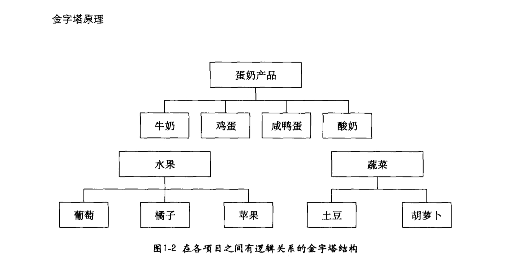
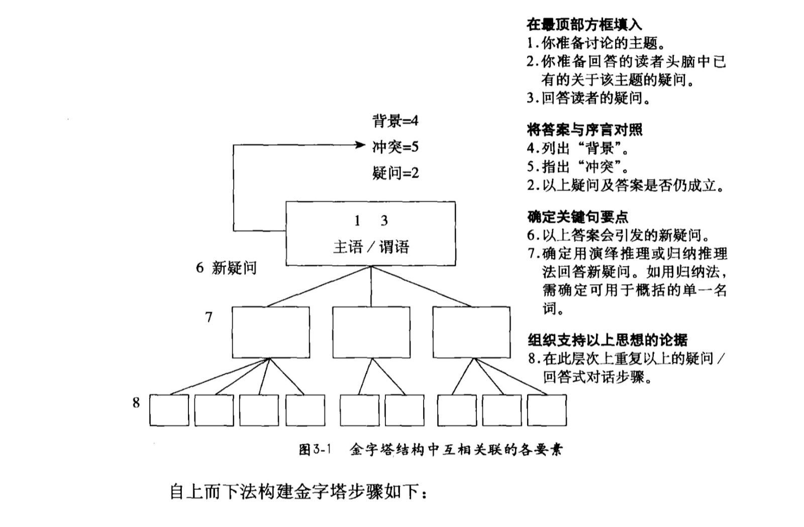
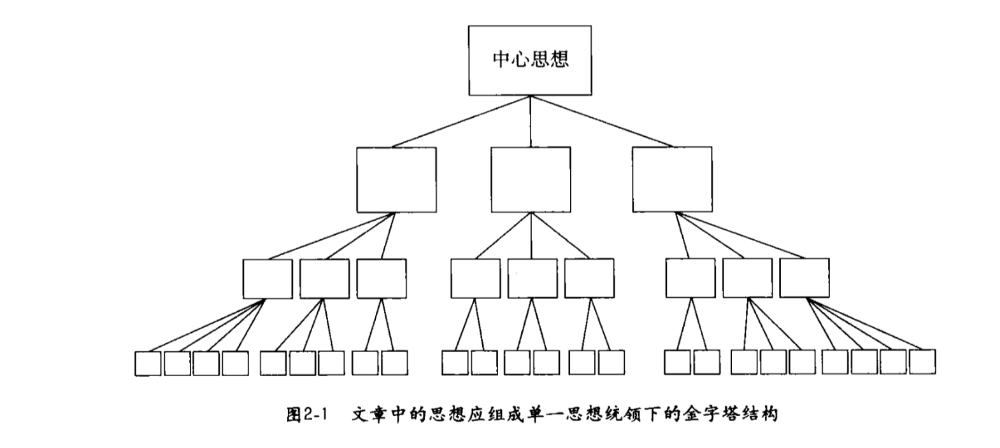
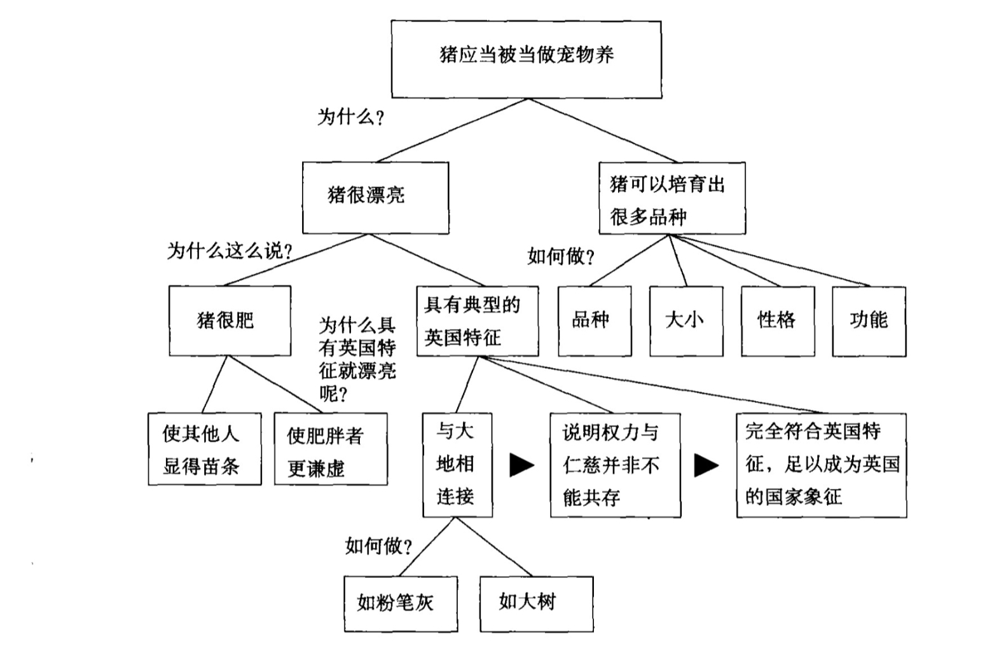
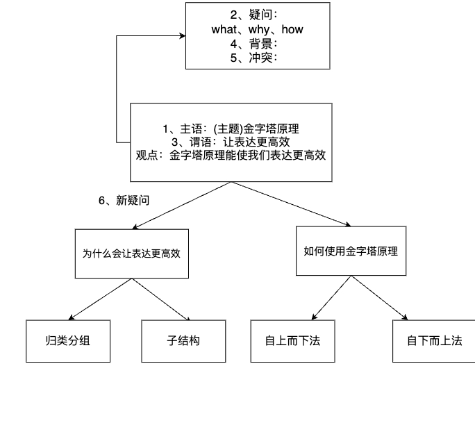

# 金字塔原理

## 概述

《金字塔原理》介绍了一种能清晰展现思路的有效方法，通过突出重点、使逻辑更清晰的方式提升表达效果。

### 核心价值

- 检查思想的有效性（逻辑正确）
- 检查思想的一致性（没有矛盾）
- 检查思想的完整性（没有遗漏）
- 使表达更加高效

---

## 一、为什么需要金字塔结构

### 问题分析

在写文章或进行沟通时，我们常常面临两个困境：
- 不知道该写什么（思路不清）
- 要写的太多不知道如何组织（逻辑混乱）

### 根本原因

文章结构混乱会导致：
- **作者**的表达思想顺序 ≠ **读者**的理解顺序
- 造成理解偏差和沟通效率低

### 解决方案

将思想组织成金字塔结构，使其：
- 结构清晰
- 易于理解
- 便于记忆

---

## 二、金字塔的两种构建方法

### 1. 自下而上法（思考方式）

**适用场景**：没有确定主题思想，需要从零开始思考

**构建步骤**：
1. 列出想表达的所有思想要点
2. 找出各要点之间的逻辑关系
3. 进行归类分组
4. 得出最终结论

**示例**：
将 9 种食品进行归类
- 葡萄、牛奶、土豆、鸡蛋、胡萝卜、橘子、咸鸭蛋、苹果、酸奶

通过逻辑关系抽象概括：
- **蛋白质来源**：牛奶、鸡蛋、咸鸭蛋
- **维生素来源**：胡萝卜、橘子、苹果
- **碳水化合物来源**：土豆、葡萄、酸奶

处于较高层次的思想能够提示其下一层次的思想，更容易被记住。

### 2. 自上而下法（表达方式）

**适用场景**：已确定主题思想，需要逐层展开表达

**构建步骤**：
1. 提出主题思想（你的观点）
2. 设想受众的疑问（What、Why、How）
3. 撰写序言
4. 与受众进行疑问/回答式对话
5. 对新产生的疑问，重复进行疑问/回答式对话

**第一层级**：
- 确定讨论主题（你的观点）
- 确定读者及其疑问
- 回答主要疑问（结论）
- 列出背景、冲突和解决方案

**第二层级及以下**：
- 回答新产生的疑问
- 选择适当的推理方式（演绎或归纳）
- 递进展开

---

## 三、金字塔的内部结构

### 三个关键子结构

#### 3.1 纵向关系（理解维度）

**定义**：上一层的思想必须是下一层思想的概括、总结或结论

**特点**：
- 自上而下的递进关系
- 结论先行
- 形成疑问/回答式对话

**作用**：
- 帮助读者理解整体逻辑脉络
- 引发读者的阅读兴趣
- 便于理解和记忆

#### 3.2 横向关系（记忆维度）

**定义**：确定同一层级思想之间的逻辑关系

**包含的推理方式**：

**演绎推理**
- 步骤：
  1. 表述世界上的某种现象
  2. 补充扩展现象中的主语和谓语
  3. 说明两种表述存在的隐含意义
- 例子：
  - 所有的人都会死
  - 苏格拉底是人
  - **结论**：因此苏格拉底会死

**归纳推理**
- 特点：用一个名词表示同一组中的所有思想
- 要求：同一组思想在逻辑上必须具有共同点
- 例子：
  - 德国坦克已抵达波兰边境
  - 法国坦克已抵达波兰边境
  - 俄国坦克已抵达波兰边境
  - **结论**：波兰将受到坦克入侵

#### 3.3 序言的叙述方式

**结构**：从已知到未知的讲故事结构

**四个要素**：
1. **背景**：读者和作者的共同背景
2. **冲突**：主题与听众之间的矛盾或问题
3. **疑问**：由冲突引发的问题
4. **回答**：对疑问的解答（你的主要观点）

**作用**：
- 引发与读者相关联的问题
- 保证正文中纵向疑问/回答式的对话逻辑通顺

---

## 四、金字塔原理的实践应用

### 思考与表达的结合

| 阶段 | 方向 | 特点 | 方法 |
|------|------|------|------|
| 思考 | 自下而上 | 归纳提炼 | 列举→分类→总结 |
| 表达 | 自上而下 | 结论先行 | 主题→疑问→回答 |

### 关键原则

1. **结论先行**：不要让读者等待你的结论
2. **逻辑清晰**：确保纵向递进关系严密
3. **分组合理**：确保横向分组有共同的逻辑依据
4. **完整呈现**：不遗漏关键信息

---

## 五、学习建议

### 如何应用金字塔原理

1. **写作**：先列出所有要点，然后分类组织，最后自上而下展开
2. **演讲**：先明确核心观点，再设计层级递进，最后组织语言
3. **沟通**：结论先行，用清晰的逻辑支撑观点
4. **解决问题**：问题分析→提出多个方案→评估→结论

### 常见误区

- ❌ 从细节开始，让读者等待结论
- ❌ 逻辑关系混乱，没有清晰的分类
- ❌ 只有结论，没有充分的论证
- ❌ 过度铺垫，忽视了核心要点
