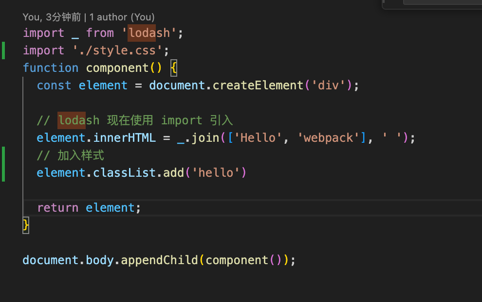
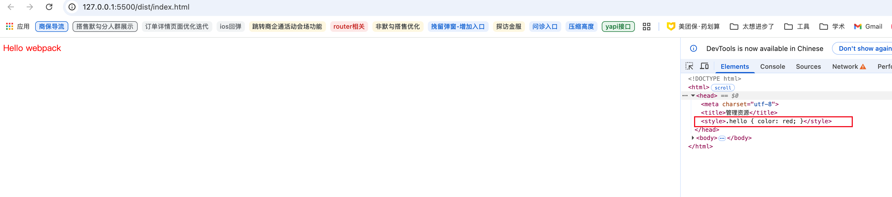

### 加载css

要想在 JavaScript 模块中导入 CSS 文件，需要安装 style-loader 和 css-loader，并在 module 配置 中添加这些 loader：

```js
npm install --save-dev style-loader css-loader
```

**webpack.config.js**

```js
 const path = require('path');

 module.exports = {
   entry: './src/index.js',
   output: {
     filename: 'bundle.js',
     path: path.resolve(__dirname, 'dist'),
   },
  module: {
    rules: [
      {
        test: /\.css$/i,
        use: ['style-loader', 'css-loader'], // 从右至左
      },
    ],
  },
 };
```

module loader 可以链式调用。链中的每个 loader 都将对资源进行转换，**不过链会逆序执行(从右至左)**。第一个 loader 将其结果（被转换后的资源）传递给下一个 loader，依此类推。最后，webpack 期望链中的最后的 loader 返回 JavaScript。

**请确保 loader 写法的先后顺序：'style-loader' 在前，而 'css-loader' 在后。实际执行是先css-loaer,再style-loader,如果不遵守此约定，webpack 可能会抛出错误。**


些配置可以帮助在依赖于此样式的 JavaScript 文件中 import './style.css'。现在，在此模块执行过程中，含有 CSS 字符串的 style 标签，将被插入到 HTML 文件的 head 中。
可以发现，head 标签包含了原本不存在的 style 块元素，也就是在 index.js 中导入的 CSS 文件中的样式。



