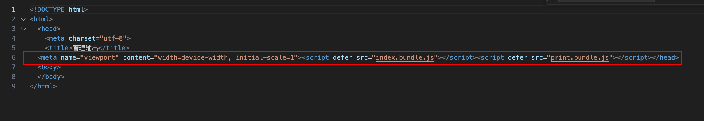

# Webpack 插件 (Plugin)

## 1. 什么是插件？

插件是 Webpack 的**支柱**。Webpack 自身无法实现的功能，大多都是通过插件完成的。

### 插件与 Loader 的区别
- **Loader**：用于特定模块类型的转换（如将 TS 转为 JS，将 CSS 转为 JS 模块）。它作用于**单个文件**。
- **Plugin**：用于执行更广泛的任务，如打包优化、资源管理、环境变量注入等。它作用于**整个构建流程**，可以触达 Webpack 构建的每一个环节（生命周期钩子）。

---

## 2. HtmlWebpackPlugin 详解

### 作用
在打包结束后，自动生成一个 HTML 文件，并**自动引入**打包生成的 bundle 文件（JS/CSS）。

### 特点，它会自动在一行，减少体积


**为什么需要它？**
1. **自动化**：手动在 HTML 中写 `<script>` 标签很麻烦，尤其是当打包文件名包含哈希值（如 `main.7a8b9c.js`）时,不可能每次都手动修改。
2. **多入口支持**：如果你有多个入口文件，它能自动帮你管理所有的引入关系。

### 安装
```bash
npm install html-webpack-plugin -D
```

### 基础用法
在 `webpack.config.js` 中配置：

```javascript
const HtmlWebpackPlugin = require('html-webpack-plugin');

module.exports = {
  plugins: [
    new HtmlWebpackPlugin({
      title: '我的博客', // 生成 HTML 的标题
      filename: 'index.html' // 生成的文件名，默认为 index.html
    })
  ]
};
```

### 使用模板 (Template)
通常我们会提供一个自己的 HTML 模板，让插件基于这个模板生成最终文件。

```javascript
new HtmlWebpackPlugin({
  template: './public/index.html', // 指定模板文件路径
  minify: { // 压缩 HTML
    collapseWhitespace: true, // 移除空格
    removeComments: true // 移除注释
  }
})
```

---

## 3. 其他常用插件推荐

| 插件名称 | 作用 |
| :--- | :--- |
| **CleanWebpackPlugin** | 每次打包前自动清理 `dist` 目录。 |
| **MiniCssExtractPlugin** | 将 CSS 提取为独立文件（而不是内联在 JS 中）。 |
| **DefinePlugin** | 允许在编译时创建全局常量（常用于区分开发/生产环境）。 |
| **BundleAnalyzerPlugin** | 可视化分析打包后的文件体积。 |

---

## 4. 插件的原理 (进阶)
Webpack 插件是一个具有 `apply` 方法的 JavaScript 对象。`apply` 方法会被 Webpack compiler 调用，并且在整个编译生命周期都可以访问 compiler 对象。

```javascript
class MyPlugin {
  apply(compiler) {
    compiler.hooks.done.tap('MyPlugin', (stats) => {
      console.log('整个 Webpack 构建流程结束了！');
    });
  }
}